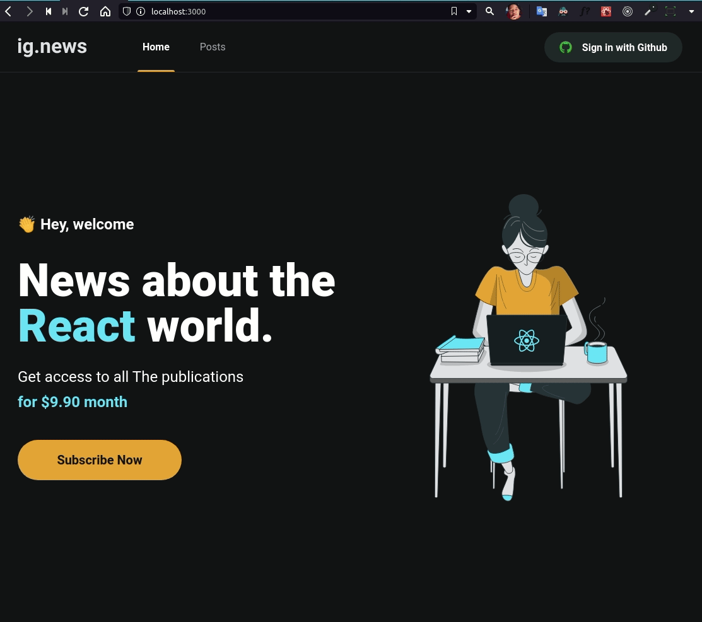

# Ig.news

O ignews é o um projeto do curso ignite React, onde tem o objetivo de ser uma plataforma de conteúdos escritos (pago).

---

### Funcionalidades da aplicação

- login social usando github
- meios de pagamentos integrando com a plataforma stripe
- SSG e SSR para geração de conteúdos performáticos com o nextjs
- gerenciamento de conteúdo do blog usando prismic integrado com o next
- controle de usuários usando o fauna db

---

### Aplicação funcionando

telas da aplicação

---

**Feito por Marcos Henrique usando o notion👋**